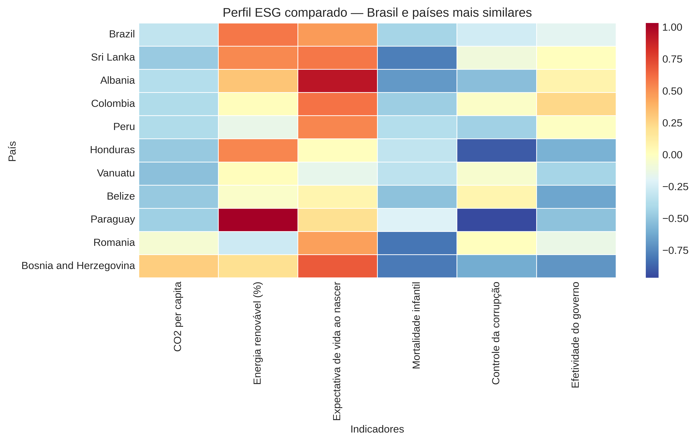
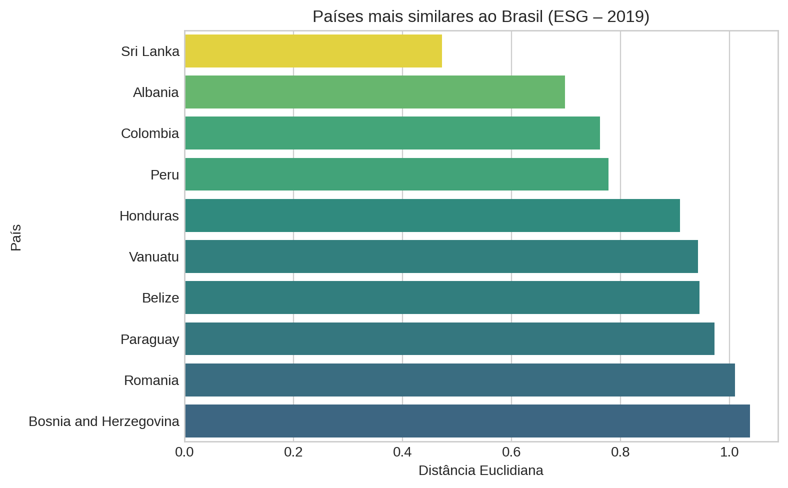
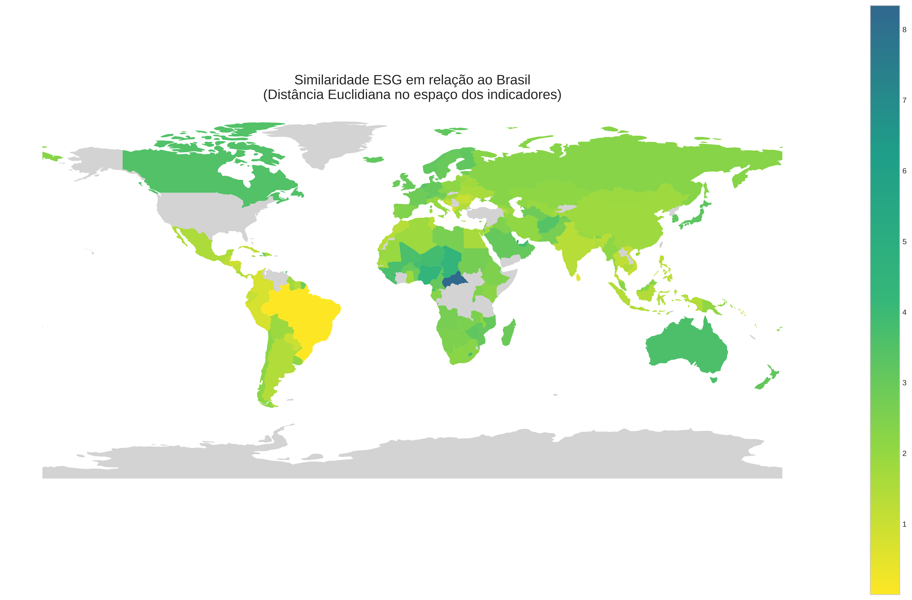
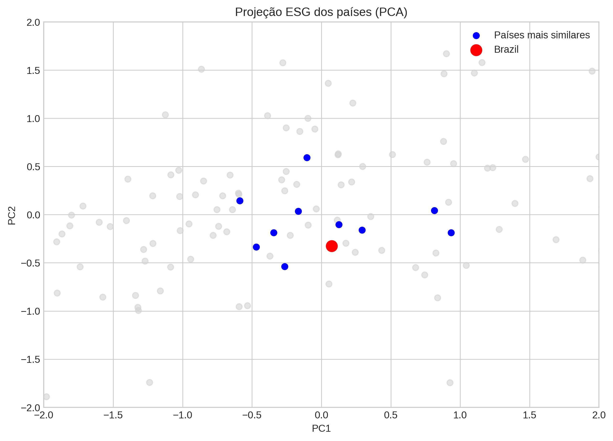

# O que significa “parecido” em dados ESG?

Quando alguém pergunta: **“Quais países são mais parecidos com o Brasil em termos de indicadores ESG?”**  
A resposta mais comum costuma vir em forma de **médias**, **rankings** ou **índices agregados**.  
Mas existe uma questão metodológica aqui.
**ESG não é uma variável**. É um **conjunto de variáveis ao mesmo tempo!!**

Indicadores <u>ambientais</u>, <u>sociais</u> e de <u>governança</u> formam um **sistema multidimensional**.  
Quando tentamos comparar países apenas olhando <u>médias</u> ou <u>rankings</u>, estamos simplificando demais um problema que é naturalmente mais complexo.  
Medidas como **média**, **mediana**, **variância** e **desvio padrão** são extremamente úteis mas, elas respondem a perguntas específicas:
 - <u><span style="color:blue">Qual é o valor típico de um indicador?</span></u>
 - <u><span style="color:blue">Quanto os valores variam?</span></u>
 - <u><span style="color:blue">Um país está acima ou abaixo da média?</span></u>

Essas métricas ajudam a entender **cada indicador isoladamente**.
Mas elas não respondem diretamente à pergunta: **Quais países são mais parecidos considerando todos os indicadores ao mesmo tempo?** Aqui surge uma mudança de perspectiva interessante. Em vez de pensar em cada indicador separadamente, podemos representar cada país como um **vetor de indicadores ESG**.

Para o nosso exemplo, vamos considerar o **ano de 2019** e o seguinte conjunto de indicadores para o Brasil:
- CO<sup>2</sup> per capita
- Energia renovável (%)
- Expectativa de vida ao nascer
- Mortalidade infantil
- Controle da corrupção
- Efetividade do governo

> **Nota:** O recorte temporal e os indicadores foram selecionados intencionalmente para ilustrar a abordagem analítica e demonstrar o processo de coleta, tratamento e integração de dados, não devendo ser interpretados como uma avaliação completa do desempenho ESG das nações consideradas.

Esse conjunto de dimensões forma, neste exemplo, um **vetor**. Cada país terá o mesmo conjunto de dimensões, que por sua vez compõe o seu próprio **vetor**. Isso nos leva a uma abordagem distinta: **medir a distância entre esses vetores**. Se dois países possuem vetores muito próximos, eles apresentam **perfis ESG semelhantes**. Quando a distância é maior, isso indica que seus perfis são mais diferentes.

Uma das formas mais simples de fazer isso é usar **distância euclidiana**, uma medida clássica em análise multivariada. Nesse caso, comparar países vira literalmente um problema de **geometria de dados**. Mas existe um detalhe importante: antes de calcular distâncias, os indicadores precisam ser **padronizados**, porque cada variável possui escala diferente (anos, toneladas, índices etc.).
Sem essa etapa, a comparação pode ficar completamente distorcida.

Essa abordagem levanta uma pergunta interessante: Talvez a discussão sobre ESG não devesse se limitar apenas a **quem está melhor no ranking**. Talvez também devêssemos perguntar: **quais países realmente se parecem entre si em termos de estrutura ESG?**

Para explorar essa ideia na prática, preparei um pequeno experimento com dados do **World Development Indicators do Banco Mundial**.

Para ver o experimento em detalhes acesso o [**notebook**](notebooks/VETOR_ESG.ipynb)

> **Nota**: Este experimento possui finalidade didática e metodológica. Os resultados apresentados **não têm** a pretensão de refletir de forma abrangente ou definitiva o perfil ESG dos países analisados. 

---
## Pergunta Analítica

O objetivo deste experimento é responder a uma relativamente simples: <span style="color:blue">quais países são mais parecidos com o Brasil em termos de indicadores ESG?</span>

Ou em termos mais analíticos: **Quais países apresentam perfis ESG mais semelhantes ao Brasil quando consideramos simultaneamente indicadores ambientais, sociais e de governança?**

A hipótese exploratória é que a similaridade entre países pode **não seguir necessariamente proximidade geográfica ou nível de renda**.

---
## Metodologia

Cada país foi representado como um **vetor de indicadores ESG**, permitindo comparar perfis nacionais de forma conjunta em um espaço multivariado.

### Etapas do experimento:

**1. Coleta de dados via API do World Bank**

&nbsp;&nbsp;&nbsp;&nbsp; Os indicadores utilizados foram obtidos diretamente da API do World Bank, garantindo acesso padronizado e reprodutível aos dados internacionais.

**2. Limpeza de entidades não analíticas (regiões e agregados)**

&nbsp;&nbsp;&nbsp;&nbsp; Foram removidas observações que não representam países individualmente, como regiões, blocos econômicos e agregados estatísticos.

**3. Preparação da base analítica**

&nbsp;&nbsp;&nbsp;&nbsp; A base foi organizada para manter apenas os países com informações utilizáveis nos indicadores selecionados para a análise.


**4. Padronização dos indicadores (z-score)**

&nbsp;&nbsp;&nbsp;&nbsp; Os indicadores foram padronizados por z-score para eliminar diferenças de escala e permitir comparações consistentes entre variáveis heterogêneas.


**5. Representação vetorial dos países**

&nbsp;&nbsp;&nbsp;&nbsp; Após a padronização, cada país passou a ser descrito por um vetor numérico composto pelos seus valores nos indicadores ESG.

**6. Cálculo de distância entre vetores**

&nbsp;&nbsp;&nbsp;&nbsp; A similaridade entre países foi estimada por meio da distância euclidiana entre seus vetores no espaço dos indicadores.

**7. Identificação de países mais semelhantes ao Brasil**

&nbsp;&nbsp;&nbsp;&nbsp; Com base nas distâncias calculadas, foram identificados os países com perfil ESG mais próximo ao do Brasil.

**8. Visualização da estrutura ESG dos países usando PCA**

&nbsp;&nbsp;&nbsp;&nbsp; A Análise de Componentes Principais (PCA) foi utilizada para projetar os países em duas dimensões e facilitar a visualização de padrões de proximidade e dispersão.

## Destaque visual



O mapa de calor compara o perfil ESG padronizado do Brasil com o dos dez países mais similares, mostrando que a proximidade ocorre principalmente nos indicadores sociais, enquanto as maiores diferenças aparecem nas dimensões de governança.

## Resultados e Discussões

Este experimento ilustra como técnicas simples de **análise multivariada baseadas em vetores** podem ser utilizadas para investigar a similaridade entre países a partir de indicadores ESG. Ao representar cada país em um espaço composto por variáveis **ambientais, sociais e de governança**, foi possível construir uma **medida sintética de proximidade** capaz de capturar padrões conjuntos que dificilmente seriam observados por análises univariadas ou por comparações baseadas apenas em médias, medianas ou rankings isolados.

### Principais pontos observados

- Países podem apresentar **perfis ESG semelhantes mesmo sem proximidade geográfica**.  
- A análise baseada em vetores permite considerar **simultaneamente múltiplos indicadores**.  
- **Métricas de distância** oferecem uma forma sistemática de comparar estruturas ESG entre países.

### Similaridade ESG entre países

Após padronizar os indicadores ESG e calcular a distância euclidiana, países como Sri Lanka, Albânia, Colômbia e Peru aparecem entre os mais similares ao Brasil, e a análise seguinte busca identificar em quais dimensões dos indicadores essa proximidade se manifesta.



Os resultados reforçam que a similaridade entre países não decorre necessariamente de **localização geográfica** ou **pertencimento regional**, mas da **configuração relativa de seus indicadores**.  



O mapa acima apresenta uma visão sintética da proximidade entre países em relação ao Brasil a partir dos indicadores ESG analisados.

Nesse contexto, o uso de métricas de distância permite comparar de forma objetiva o **posicionamento dos países no espaço ESG** e identificar aqueles que apresentam perfil mais próximo ao do Brasil, considerando simultaneamente diferentes dimensões analíticas.

### Contribuição analítica do experimento

Este experimento demonstra como métodos simples de análise de dados podem complementar abordagens tradicionais baseadas apenas em médias ou rankings.

A principal contribuição desta análise está em propor uma leitura integrada da similaridade ESG entre países, oferecendo uma perspectiva adicional às comparações tradicionais de desempenho.

Se análises baseadas em rankings costumam ser utilizadas para orientar decisões de investimento ao identificar países com melhor ou pior desempenho em determinados indicadores, a análise de similaridade baseada em vetores oferece uma abordagem complementar: ela permite identificar **quais países são estruturalmente comparáveis entre si**.

É importante reconhecer que a análise de similaridade, isoladamente, não gera um sinal direto de investimento. Seu valor aparece quando utilizada como **ferramenta de comparação estrutural** dentro de um processo mais amplo de avaliação de risco e alocação de capital.

Nesse contexto, a análise de similaridade ESG ajuda a responder uma pergunta relevante para investidores e analistas: **quais países apresentam estruturas Ambientais, Sociais e de Governança comparáveis?**

A partir dessa identificação, torna-se possível avaliar diferenças de risco, retorno ou valuation entre economias semelhantes, o que pode revelar oportunidades relativas ou indicar situações em que determinados riscos estejam subestimados.

**Um insight curioso**: o Brasil aparece próximo ao centro da distribuição no espaço dos indicadores ESG analisados , indicando um perfil intermediário entre os países (gráfico abaixo). Esse resultado condiz com a posição do país em rankings internacionais de desempenho ambiental.



> **Nota**: Posição do Brasil no Environmental Performance Index (EPI) 2020: 55° (https://epi.yale.edu/epi-results/2020/country/bra
)

### Limitações e considerações metodológicas

Por fim, o estudo mostra que **métodos estatísticos relativamente simples**, quando bem aplicados, podem ampliar a qualidade da análise comparativa em bases internacionais.  

Ao mesmo tempo, é importante reconhecer que os resultados dependem de alguns fatores metodológicos importantes:

- **Escolha dos indicadores**
- **Forma de padronização das variáveis**
- **Métrica de distância adotada**

---

> Quando tratamos países como **vetores de dados**, a pergunta *“quem é parecido com quem?”* deixa de ser uma impressão intuitiva e passa a ser **uma questão mensurável no espaço dos indicadores**.

## Estrutura do repositório

- `notebooks/` → notebook principal do estudo
- `images/` → gráficos exportados
- `README.md` → apresentação do projeto

## Como reproduzir
```bash
git clone https://github.com/vieiradatalab/VETOR_ESG.git
cd VETOR_ESG
pip install -r requirements.txt